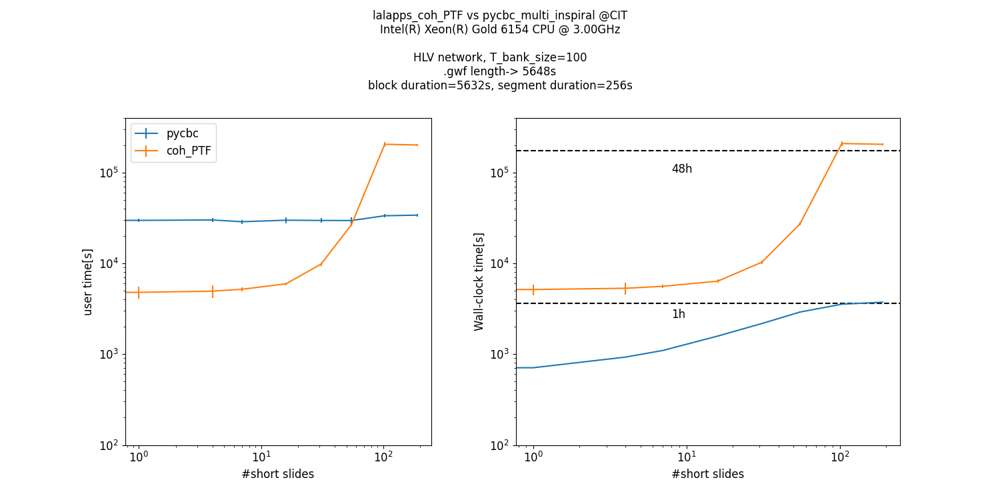

# PyGRB_performance
The current repository contains several performance tests for [`pycbc_multi_inspiral`](https://github.com/gwastro/pycbc/blob/master/bin/pycbc_multi_inspiral).

An extensive description of the performance tests and bottleneck identification can be found in this [wikipage](https://github.com/sebastiangomezlopez/PyGRB_performance/wiki/LOG:-Performance-tests-and-Bottlenecks). Currently the performance tests show the following comparison between `pycbc_multi_inspiral` vs `lalapps_coh_PTF_inspiral`



## Dependencies 

PyCBC,grpof2dot,graphviz,snakeviz,scalene.

Moreover, To reproduce the results present in. 

- `pycbc_multi_inspiral`: create a conda environment witht the latest version of `pycbc`
- `lalapps_coh_PTF_inspiral`: only possible using michael patel's `pygrb_o3b` environment on CIT.

### General usage:
1. Activate your conda environment with `pycbc`
2. Move your frame files to `files`, and modify lines [75](https://github.com/sebastiangomezlopez/PyGRB_performance/blob/11914a55c8a905749f7097d2b9d6ed510226958d/timing/mi_core.sh#L75) to [83](https://github.com/sebastiangomezlopez/PyGRB_performance/blob/11914a55c8a905749f7097d2b9d6ed510226958d/timing/mi_core.sh#L83) to specify their channels and filenames.

## Description

This repository contains different types of python and shell scripts to identify bottlenecks in `pycbc_multi_inspiral` and  compare it to `lalapps_coh_PTF_inspiral` by timing both of their performances.

- gprof2dot scripts. To identify bottlenecks for a given set of inputs
- Timing scripts.

### Profiling scripts:

### Timing scripts:
Built to measure performance differences of `pycbc_multi_inspiral` vs `lalapps_coh_PTF_inspiral`. We fix many parameters as in the [`pycbc_multi_inspiral` example](https://github.com/gwastro/pycbc/blob/master/bin/pycbc_multi_inspiral), and let as free parameters `block_duration` `segment_duration` `number of short slides` & `template bank size`. 

### `pycbc_multi_inspiral`

This repo contains three types:

- oneT_slides scripts. "one template with varying slides". Lives in: `timing/oneT_varslides/multi_insp`:

 ```
 cd timing/oneT_varslides/multi_insp
 ./oneT_slides.sh -outpath <path> -outfile <filename>
 ```
 
- NT_slides scripts. "N templates with varying slides". Lives in: `timing/modern/NT_slides_mi`

 ```
 cd timing/NT_varslides/multi_insp
 ./NT_slides.sh -outpath <path> -outfile <filename>
 ```

- oneS-T_lens scripts(Broken). "No slides, one template with varying length(`block_duration`)".

NOTE: most of this scripts are refactored versions of the run.sh [example](https://github.com/gwastro/pycbc/blob/master/examples/multi_inspiral/run.sh) that analyzes GW170817.

### `lalapps_cohPTF_inspiral`

As mentioned above all the tests related to this old executable can only be excecuted in CIT clusters using michael patel's 
pygrb-o3b python 2.7 environment.

1. Activate the environment using `conda activate /home/michael.patel/.conda/envs/pygrb-o3b`
3. Since this executable relies on cache files to read frame files we have to modify them acordingly:
  - Manually:
      
      See the structure of `files/coh-common/H1.lcf`, used for the frame file `H-H1_GWOSC_4KHZ_R1-1187006835-4096.gwf`. It has the following pattern:
      ```
      <text-string-without_hyphens> <gps-time> <time-in-file-insec> file://localhost/<abs_path-to-frame>
      ```
      Matching:
      ```
      H H1_GWOSC_4KHZ_R1 1187006835 4096 file://localhost/home/sebastian.gomezlopez/REPOS_caltech/pycbc/examples/multi_inspiral/H-H1_GWOSC_4KHZ_R1-1187006835-4096.gwf
      ```
  - Using the script `files/coh-common/update_path.sh`
    ```
    cd files/coh-common
    ./update_path.sh <abs_path-to-all_frames>
    ```
NOTE1: It is not necessary to download frame files for this scripts. Since they can only be used on CIT, the scripts will read the files living in `/home/sebastian.gomezlopez/REPOS_caltech/pycbc/examples/multi_inspiral` automatically. 

NOTE2: If you want to use your own files. you will have to modify the cache files in `files/coh-common` and the core script `timing/coh_core.sh` specifically from line [71](https://github.com/sebastiangomezlopez/PyGRB_performance/blob/11914a55c8a905749f7097d2b9d6ed510226958d/timing/coh_core.sh#L74) to [80](https://github.com/sebastiangomezlopez/PyGRB_performance/blob/11914a55c8a905749f7097d2b9d6ed510226958d/timing/coh_core.sh#L80).


The usage for this scripts is exaclty the same as the ones for `pycbc_multi_inspiral` (see description above)

- oneT_slides scripts

 ```
 cd timing/oneT_varslides/coh_PTF
 ./oneT_slides.sh -outpath <path> -outfile <filename>
 ```
 
- NT_slides scripts. 

 ```
 cd timing/NT_varslides/coh_PTF
 ./NT_slides.sh -outpath <path> -outfile <filename>
 ```

- oneS-T_lens scripts(Broken). "No slides, one template with varying length(`block_duration`)".
